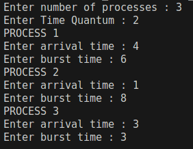
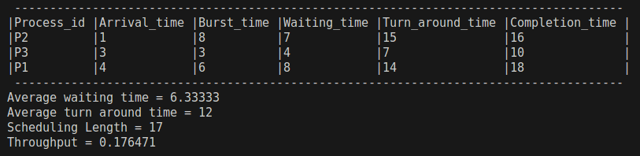
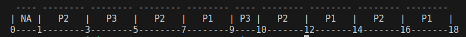

# CPU Scheduling Algorithms

This repository contains C++ implementations of various CPU scheduling algorithms, demonstrating how processes are selected for execution based on different strategies. It includes **FCFS, SJF, Priority Scheduling, HRRN, and Round Robin**. Each implementation also considers **tie-breaking criteria** when two or more processes have the same selection factor.

Each implementation not only schedules processes but also:  
- Prints a **process table** showing arrival time, burst time, waiting time, turnaround time, and completion time  
- Displays a **Gantt chart** for visualizing process execution order  
- Computes and displays performance metrics such as:  
  - **Average Waiting Time (AWT)**  
  - **Average Turnaround Time (ATAT)**  
  - **Scheduling Length (SL)**  
  - **Throughput**  

---

## 📌 Algorithms Overview

### 1. First Come First Serve (FCFS)
- **Description:** Processes are executed in the order they arrive in the ready queue.  
- **Selection Factor:** Arrival time.  
- **Tie-Breaker:** Lower Process ID (PID) is chosen if arrival times are the same.

---

### 2. Shortest Job First (SJF) — Non-Preemptive
- **Description:** Process with the shortest burst time is executed first.  
- **Selection Factor:** Burst time.  
- **Tie-Breaker Order:**  
  1. Arrival time (earlier arrival gets priority)  
  2. PID (lower PID if arrival and burst time are same)

---

### 3. Priority Scheduling — Non-Preemptive
- **Description:** Process with the highest priority is executed first. (Lower priority value = higher priority)  
- **Selection Factor:** Priority value.  
- **Tie-Breaker Order:**  
  1. Arrival time  
  2. PID (lower PID if both priority and arrival are same)

---

### 4. Highest Response Ratio Next (HRRN)
- **Description:** Chooses the process with the highest response ratio:  
  **Response Ratio = (Waiting Time + Burst Time) / Burst Time**  
  This balances short jobs and long waiting processes.  
- **Selection Factor:** Highest Response Ratio.  
- **Tie-Breaker Order:**  
  1. Arrival time  
  2. PID (lower PID if arrival time is same)

---

### 5. Round Robin (RR)
- **Description:** Each process gets a fixed time quantum in a cyclic order, ensuring fairness.  
- **Selection Factor:** Queue order (processes are picked in the order they were last in the queue).  
- **Tie-Breaker:** Not needed within execution, but if multiple arrive at same time, lower PID goes first.

---

## Sample Execution

### Input

### Output

### Gantt Chart
